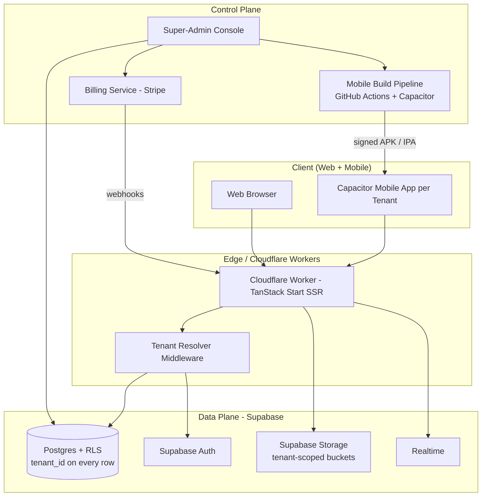
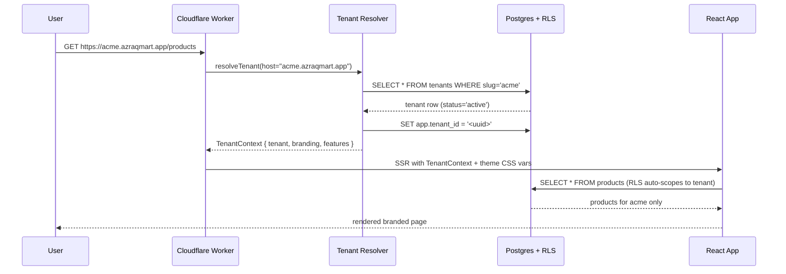
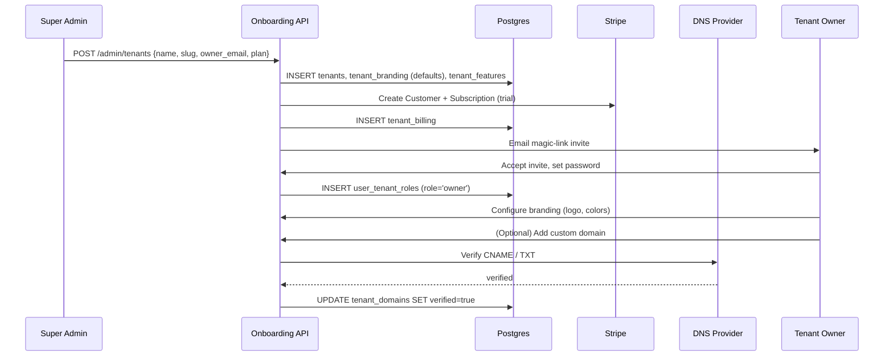
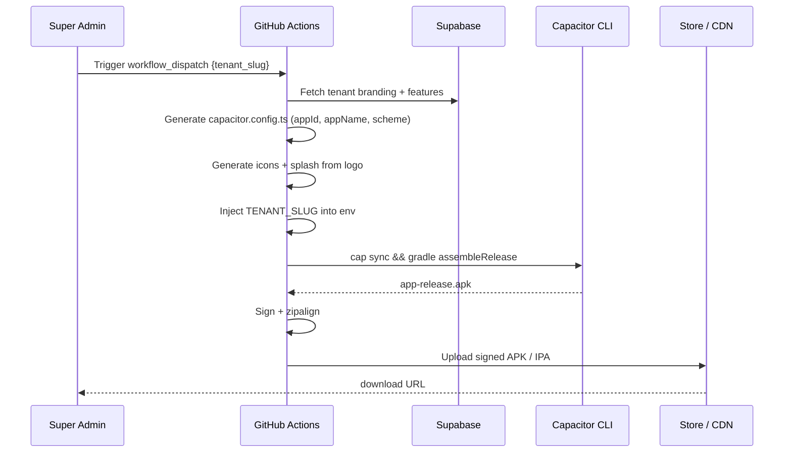
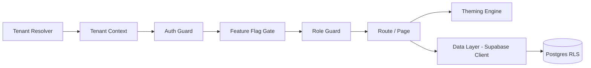
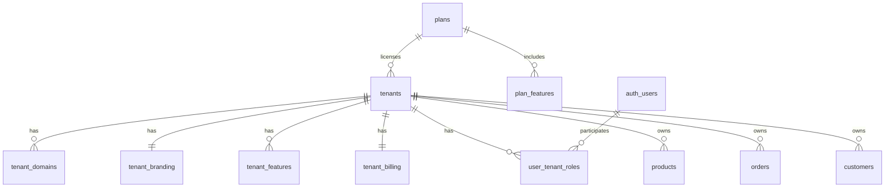

# Design Document: White-Label SaaS System

## Overview

This design transforms the existing single-tenant **azraqmart** marketplace (TanStack Start + React 19 + Supabase + Capacitor + Cloudflare Workers) into a **multi-tenant white-label SaaS platform**. Multiple businesses (tenants) can each operate a fully branded grocery/marketplace storefront from a single shared codebase and infrastructure.

Each tenant gets isolated data via Postgres Row-Level Security on Supabase, a custom domain or platform subdomain, configurable branding (logo, colors, fonts, copy), per-tenant feature module enablement, role-based access scoped per tenant, a subscription with billing, and optionally a per-tenant branded mobile app produced from a single Capacitor project via build-time configuration.

A **super-admin console** governs the entire platform: provisioning tenants, managing subscriptions, monitoring usage, and toggling feature flags. The architecture is designed so the migration from the current single-tenant codebase is incremental: introduce a `tenants` table, add `tenant_id` to all domain tables, enable RLS in shadow mode, then plug a `TenantContext` provider into the existing routes and components.

This document combines a **High-Level Design** (architecture, sequence diagrams, components, data models) with a **Low-Level Design** (algorithmic pseudocode, formal function specifications, correctness properties).

## Architecture

The platform is a single shared codebase rendered on Cloudflare Workers, a single Supabase project for data + auth + storage, and per-tenant artifacts produced at build time for mobile.



### Tenancy Model

- **Single database, shared schema, row-level isolation** via Postgres RLS.
- Every domain table carries a non-null `tenant_id uuid` foreign key into `tenants(id)`.
- Every RLS policy filters on `tenant_id = current_setting('app.tenant_id')::uuid`.
- The `app.tenant_id` GUC is set at the start of each request by the **Tenant Resolver Middleware**.
- Justification: shared schema is cheapest to operate at the platform's scale (tens to low thousands of tenants), keeps schema migrations atomic, and works with Supabase's managed Postgres without custom per-tenant DB provisioning.

### Tenant Resolution

Tenant identity is resolved on every request, in this priority order:

1. **Custom domain** (`shop.acmegrocers.com`) — exact match in `tenant_domains.domain`.
2. **Platform subdomain** (`acme.azraqmart.app`) — match on `tenants.slug`.
3. **Mobile build constant** — Capacitor app injects `__TENANT_SLUG__` at build time; sent as `X-Tenant-Slug` header.
4. **Path prefix fallback** (dev only) — `/_t/:slug/...`.

If no tenant is resolved, the user is redirected to the marketing site (or super-admin login for the apex domain).

### Request Lifecycle (Web)



### Tenant Onboarding



### Mobile App Build per Tenant



### Migration Path from Single-Tenant azraqmart

The migration is staged so the app keeps working at every step.

| Phase | Action | Risk |
|---|---|---|
| 0. Baseline | Snapshot DB; freeze schema. | none |
| 1. Introduce platform tables | Create `tenants`, `tenant_branding`, `tenant_features`, `plans`, `tenant_billing`, `user_tenant_roles`. Insert one default tenant `azraqmart` matching current data. | low |
| 2. Add tenant_id columns | `ALTER TABLE products ADD tenant_id uuid` (nullable initially), backfill to default tenant, then `SET NOT NULL`. Repeat for every domain table. | medium |
| 3. Enable RLS in shadow mode | Add policies but keep them permissive; log denied queries to a side table to find missing scoping. | medium |
| 4. Wire Tenant Resolver | Add middleware; for now resolves everything to default tenant. Introduce `TenantContext` provider in `src/`. | low |
| 5. Refactor data calls | Replace direct Supabase queries with a `tenantClient(supabase, tenantId)` wrapper that sets the GUC. | medium |
| 6. Enforce RLS strictly | Switch policies to deny-by-default. Run smoke tests. | medium |
| 7. Multi-tenant features | Custom domains, branding editor, feature flag gates, super-admin console, billing webhooks. | medium |
| 8. Mobile per-tenant builds | Parameterize `capacitor.config.ts`; add GitHub Actions workflow. | low |
| 9. Onboard second tenant | Provision a real second tenant end-to-end; validate isolation with security tests. | high (validation) |

## Components and Interfaces



### Component: Tenant Resolver

**Purpose:** Maps an incoming request to a `Tenant` record, sets the `app.tenant_id` GUC, and provides the tenant context to downstream handlers.

**Interface:**

```typescript
interface TenantResolver {
  resolveTenant(host: string, headers: Headers): Promise<ResolveResult>
  invalidateCache(tenantId: string): Promise<void>
}

type ResolveResult =
  | { ok: true; tenant: Tenant }
  | { ok: false; reason: 'not_found' | 'suspended' | 'invalid_host' }
```

**Responsibilities:**
- Resolve via custom domain → subdomain → header → path prefix.
- Cache results in Worker memory + Cloudflare KV (60s TTL).
- Reject suspended/cancelled tenants with `402`.

### Component: Tenant Context

**Purpose:** React context exposing the current tenant to all components and routes.

**Interface:**

```typescript
interface TenantContextValue {
  tenant: Tenant
  branding: TenantBranding
  features: TenantFeatures
  subscription: Subscription
}

function TenantProvider(props: { value: TenantContextValue; children: ReactNode }): JSX.Element
function useTenant(): TenantContextValue
```

**Responsibilities:**
- Provide tenant data without prop-drilling.
- Re-hydrate on the client from SSR-injected JSON.
- Throw if used outside provider (catches missing-resolver bugs).

### Component: Theming Engine

**Purpose:** Generate CSS custom properties from `tenant_branding`; integrate with Tailwind v4 theme; swap logo and assets.

**Interface:**

```typescript
interface ThemingEngine {
  applyBranding(branding: TenantBranding): string  // returns CSS
  resolveLogo(branding: TenantBranding, variant: 'light' | 'dark'): string
}
```

**Responsibilities:**
- Emit `:root[data-tenant="<slug>"] { --primary: ...; }` CSS.
- Sanitize tenant-supplied values (escape `</style>`, validate hex colors).
- Memoize per `(tenant_id, version)`.

### Component: Feature Flag Gate

**Purpose:** Gate routes and UI per tenant subscription tier and admin overrides.

**Interface:**

```typescript
interface FeatureGate {
  evaluateFeature(features: TenantFeatures, key: FeatureKey, override?: FeatureOverride): boolean
  computeEnabledFeatures(tenantId: string): Promise<ReadonlySet<FeatureKey>>
}

function Feature(props: { flag: FeatureKey; children: ReactNode; fallback?: ReactNode }): JSX.Element
```

**Responsibilities:**
- Combine `plan_features` with `tenant_features` overrides.
- Honor `expires_at` on overrides.
- Provide a React component for declarative gating.

### Component: Role Guard

**Purpose:** Enforce role-based access control scoped per tenant.

**Interface:**

```typescript
interface RoleGuard {
  assertRole(userId: string, tenantId: string, required: UserRole | UserRole[]): Promise<void>
  hasRole(userId: string, tenantId: string, required: UserRole): Promise<boolean>
  listUserTenants(userId: string): Promise<UserTenantRole[]>
}
```

**Responsibilities:**
- Look up `user_tenant_roles` and apply role hierarchy.
- Reject cross-tenant access (user from tenant A cannot act in tenant B).
- Power the existing `RoleGuard.tsx` component, extended with tenant scope.

### Component: Subscription / Billing

**Purpose:** Manage Stripe customer + subscription per tenant; sync state via webhooks.

**Interface:**

```typescript
interface BillingService {
  createSubscription(tenantId: string, planCode: string, trialDays?: number): Promise<Subscription>
  changePlan(tenantId: string, newPlanCode: string): Promise<Subscription>
  cancelSubscription(tenantId: string, immediate?: boolean): Promise<void>
  handleWebhook(rawBody: string, signature: string): Promise<void>
}
```

**Responsibilities:**
- Create Stripe Customer + Subscription on tenant provisioning.
- On webhook: update `tenant_billing.status` and `tenants.status`.
- Trigger `suspended` state on `customer.subscription.deleted` or `payment_failed` past dunning.

### Component: Custom Domain Manager

**Purpose:** Allow tenants to bring their own domain; verify ownership; serve via Cloudflare SSL for SaaS.

**Interface:**

```typescript
interface DomainManager {
  addDomain(tenantId: string, domain: string): Promise<TenantDomain>
  verifyDomain(domainId: string): Promise<{ verified: boolean; reason?: string }>
  removeDomain(domainId: string): Promise<void>
}
```

**Responsibilities:**
- Issue a per-domain TXT verification token.
- Periodically re-check DNS until verified or expired.
- Trigger Cloudflare SSL-for-SaaS hostname provisioning on success.

### Component: Super-Admin Console

**Purpose:** Platform-wide administration on `admin.azraqmart.app`.

**Interface:**

```typescript
interface SuperAdminApi {
  provisionTenant(input: ProvisionInput): Promise<Tenant>
  suspendTenant(tenantId: string, reason: string): Promise<void>
  resumeTenant(tenantId: string): Promise<void>
  listTenants(filter?: TenantFilter): Promise<Tenant[]>
  setFeatureOverride(tenantId: string, key: FeatureKey, enabled: boolean, expiresAt?: string): Promise<void>
  triggerMobileBuild(tenantId: string, target: 'android' | 'ios'): Promise<{ runId: string }>
}
```

**Responsibilities:**
- Bypass `TenantContext` (uses `platform_admin` JWT claim).
- Require MFA for all mutating endpoints.
- Audit-log every action to `platform_audit_log`.

### Component: Mobile Build Pipeline

**Purpose:** Produce a per-tenant signed APK/IPA from a single Capacitor project.

**Interface:** GitHub Actions `workflow_dispatch` with input `tenant_slug` and `target`.

**Responsibilities:**
- Fetch tenant branding from Supabase.
- Generate `capacitor.config.ts` (unique `appId`, `appName`, deep-link scheme).
- Run `pwa-asset-generator` for icons/splash from tenant logo.
- Sign with platform-managed certificate; upload to CDN.

## Data Models



### Model: Tenant

```typescript
interface Tenant {
  id: string                  // uuid v4
  slug: string                // unique, kebab-case, 3..32 chars, [a-z0-9-]
  name: string
  status: 'active' | 'trialing' | 'past_due' | 'suspended' | 'cancelled'
  planId: string
  createdAt: string           // ISO 8601
  updatedAt: string
}
```

**Validation Rules:**
- `slug` matches `^[a-z0-9](-?[a-z0-9])*$`, length 3–32, must be unique, cannot collide with reserved slugs (`admin`, `api`, `www`, `app`).
- `status` transitions are constrained: `trialing → active → past_due → suspended → cancelled` (no skipping back to `active` from `cancelled`).
- `planId` must reference an existing `plans.id`.

### Model: TenantBranding

```typescript
interface TenantBranding {
  tenantId: string
  logoUrl: string | null
  primaryColor: string        // hex #RRGGBB
  accentColor: string         // hex #RRGGBB
  fontFamily: string          // CSS font-family value
  themeTokens: Record<string, string>  // additional CSS custom properties
  copyOverrides: Record<string, string> // i18n key → string
  version: number             // bumped on every save; used for cache busting
}
```

**Validation Rules:**
- `primaryColor` and `accentColor` match `^#[0-9a-fA-F]{6}$`.
- `logoUrl` must be on platform CDN or tenant-verified domain.
- `themeTokens` keys must be valid CSS custom property names.
- `copyOverrides` values are sanitized (HTML stripped).

### Model: TenantDomain

```typescript
interface TenantDomain {
  id: string
  tenantId: string
  domain: string              // FQDN, lowercase, RFC 1123
  verificationToken: string   // TXT record value
  verified: boolean
  isPrimary: boolean
  createdAt: string
}
```

**Validation Rules:**
- `domain` is unique across all tenants.
- Only one `isPrimary=true` per tenant.
- Cannot use platform apex (`azraqmart.app`) or reserved subdomains.

### Model: Plan + PlanFeatures

```typescript
interface Plan {
  id: string
  code: string                // e.g. 'starter', 'pro', 'enterprise'
  name: string
  priceCents: number
  stripePriceId: string
  isPublic: boolean
}

interface PlanFeature {
  planId: string
  featureKey: FeatureKey
  enabled: boolean
}

type FeatureKey =
  | 'loyalty'
  | 'push_notifications'
  | 'multi_branch'
  | 'custom_domain'
  | 'mobile_app'
  | 'chat_widget'
  | 'advanced_analytics'
```

**Validation Rules:**
- `code` is unique and immutable after creation.
- `priceCents >= 0`.

### Model: TenantFeatures (Overrides)

```typescript
interface TenantFeatureOverride {
  tenantId: string
  featureKey: FeatureKey
  enabled: boolean            // can enable above plan or disable below plan
  expiresAt: string | null    // null = permanent override
}
```

**Validation Rules:**
- Composite primary key `(tenantId, featureKey)`.
- `expiresAt` if set must be in the future at insert time.

### Model: TenantBilling

```typescript
interface TenantBilling {
  tenantId: string
  stripeCustomerId: string
  stripeSubscriptionId: string | null
  status: TenantStatus
  currentPeriodEnd: string | null
}
```

**Validation Rules:**
- `stripeCustomerId` is unique across tenants.
- `status` mirrors `tenants.status` (kept in sync by webhook handler).

### Model: UserTenantRole

```typescript
interface UserTenantRole {
  userId: string
  tenantId: string
  role: 'owner' | 'admin' | 'staff' | 'delivery' | 'customer'
  createdAt: string
}
```

**Validation Rules:**
- Composite primary key `(userId, tenantId)`.
- Exactly one `role='owner'` per tenant at any time.
- A user can belong to many tenants with different roles (multi-tenant users supported).

### Core Type Definitions (Authoritative)

```typescript
// src/lib/tenancy/types.ts

export type TenantStatus = 'active' | 'trialing' | 'past_due' | 'suspended' | 'cancelled'
export type UserRole = 'owner' | 'admin' | 'staff' | 'delivery' | 'customer'

export interface TenantFeatures {
  tenantId: string
  enabled: ReadonlySet<FeatureKey>  // effective set after merging plan + overrides
}

export interface Subscription {
  tenantId: string
  planId: string
  stripeCustomerId: string
  stripeSubscriptionId: string | null
  status: TenantStatus
  currentPeriodEnd: string | null
}

export interface FeatureOverride {
  enabled: boolean
  expiresAt?: string
}
```

## Algorithmic Pseudocode

This section provides formal algorithms for the core operations. Each algorithm includes preconditions, postconditions, and loop invariants.

### Tenant Resolution

```pascal
ALGORITHM resolveTenant(host, headers)
INPUT: host: string, headers: Headers
OUTPUT: ResolveResult

BEGIN
  ASSERT isValidHostname(host)

  // 1. Cache lookup
  cached <- TenantCache.get(host)
  IF cached <> NULL AND cached.expiresAt > now() THEN
    RETURN { ok: true, tenant: cached.tenant }
  END IF

  tenant <- NULL

  // 2. Try custom domain
  domainRow <- db.query('SELECT t.* FROM tenants t
                         JOIN tenant_domains d ON d.tenant_id=t.id
                         WHERE d.domain=$1 AND d.verified=true', host)
  IF domainRow <> NULL THEN
    tenant <- domainRow
  END IF

  // 3. Try platform subdomain
  IF tenant = NULL AND endsWith(host, '.azraqmart.app') THEN
    slug <- stripSuffix(host, '.azraqmart.app')
    tenant <- db.query('SELECT * FROM tenants WHERE slug=$1', slug)
  END IF

  // 4. Try mobile header
  IF tenant = NULL THEN
    slug <- headers.get('X-Tenant-Slug')
    IF slug <> NULL THEN
      tenant <- db.query('SELECT * FROM tenants WHERE slug=$1', slug)
    END IF
  END IF

  // 5. Decide
  IF tenant = NULL THEN
    RETURN { ok: false, reason: 'not_found' }
  END IF

  IF tenant.status IN ('suspended', 'cancelled') THEN
    RETURN { ok: false, reason: 'suspended' }
  END IF

  TenantCache.set(host, tenant, ttl=60s)
  RETURN { ok: true, tenant: tenant }
END
```

**Preconditions:** `host` is RFC-1123 lowercased; DB and cache are reachable.
**Postconditions:** Result reflects current DB state within cache TTL; no DB row is mutated.
**Loop invariants:** N/A.

### Effective Feature Set Computation

```pascal
ALGORITHM computeEnabledFeatures(tenantId)
INPUT: tenantId: uuid
OUTPUT: enabled: Set<FeatureKey>

BEGIN
  plan <- db.query('SELECT plan_id FROM tenants WHERE id=$1', tenantId)
  planFeatures <- db.query('SELECT feature_key FROM plan_features
                            WHERE plan_id=$1 AND enabled=true', plan.plan_id)

  enabled <- new Set()
  FOR each f IN planFeatures DO
    enabled.add(f.feature_key)
  END FOR

  // Tenant-level overrides
  overrides <- db.query('SELECT feature_key, enabled, expires_at
                         FROM tenant_features WHERE tenant_id=$1', tenantId)
  FOR each o IN overrides DO
    ASSERT enabled is a finite subset of valid FeatureKey values

    IF o.expires_at <> NULL AND o.expires_at <= now() THEN
      CONTINUE   // Expired override, ignore
    END IF

    IF o.enabled = true THEN
      enabled.add(o.feature_key)
    ELSE
      enabled.remove(o.feature_key)
    END IF
  END FOR

  RETURN enabled
END
```

**Preconditions:** `tenantId` exists in `tenants`.
**Postconditions:** Returned set is a subset of all known `FeatureKey` values; reflects plan + overrides at call time.
**Loop invariants:**
- `enabled` is a subset of `FeatureKey` at all times.
- After processing the i-th override, `enabled` equals the plan baseline modified by overrides 1..i.

### Tenant Provisioning (Atomic)

```pascal
ALGORITHM provisionTenant(name, slug, ownerEmail, planCode)
INPUT: name: string, slug: string, ownerEmail: string, planCode: string
OUTPUT: tenant: Tenant

BEGIN
  ASSERT matches(slug, '^[a-z0-9](-?[a-z0-9])*$') AND length(slug) IN [3..32]
  ASSERT slug NOT IN RESERVED_SLUGS
  ASSERT isValidEmail(ownerEmail)

  plan <- db.query('SELECT * FROM plans WHERE code=$1', planCode)
  IF plan = NULL THEN THROW NotFoundError('plan') END IF

  BEGIN TRANSACTION
    tenant <- db.insert('tenants', {
      slug: slug, name: name, plan_id: plan.id, status: 'trialing'
    })
    db.insert('tenant_branding', defaultBranding(tenant.id))

    user <- auth.findOrInviteUser(ownerEmail)
    db.insert('user_tenant_roles', {
      user_id: user.id, tenant_id: tenant.id, role: 'owner'
    })

    customer <- stripe.createCustomer({
      email: ownerEmail, metadata: { tenant_id: tenant.id }
    })
    sub <- stripe.createSubscription({
      customer: customer.id, price: plan.stripe_price_id, trial_days: 14
    })
    db.insert('tenant_billing', {
      tenant_id: tenant.id,
      stripe_customer_id: customer.id,
      stripe_subscription_id: sub.id,
      status: sub.status
    })
  COMMIT

  // If commit fails, compensating Stripe deletion is triggered
  ON ROLLBACK:
    IF customer was created THEN stripe.deleteCustomer(customer.id) END IF
    THROW

  auth.sendMagicLink(user.id, redirectTo: '/onboarding')
  audit.log('tenant.provisioned', { tenant_id: tenant.id, actor: currentAdmin().id })

  RETURN tenant
END
```

**Preconditions:** Caller has `platform_admin` role; Stripe and Supabase Auth are reachable.
**Postconditions:** On success, `tenants`, `tenant_branding`, `user_tenant_roles`, `tenant_billing` rows exist consistently. On failure, no partial state remains (transaction rollback + Stripe compensating delete).
**Loop invariants:** N/A.

### Custom Domain Verification

```pascal
ALGORITHM verifyDomain(domainId)
INPUT: domainId: uuid
OUTPUT: { verified: boolean, reason?: string }

BEGIN
  d <- db.query('SELECT * FROM tenant_domains WHERE id=$1', domainId)
  IF d = NULL THEN THROW NotFoundError END IF
  IF d.verified = true THEN RETURN { verified: true } END IF

  expectedToken <- 'azraqmart-verify=' + d.verification_token
  txtRecords <- dns.lookupTxt('_azraqmart.' + d.domain)

  found <- false
  FOR each rec IN txtRecords DO
    IF rec = expectedToken THEN
      found <- true
      BREAK
    END IF
  END FOR

  IF NOT found THEN
    RETURN { verified: false, reason: 'txt_not_found' }
  END IF

  // Provision SSL via Cloudflare SSL-for-SaaS
  cf <- cloudflare.addCustomHostname(d.domain)
  IF cf.status <> 'active' THEN
    RETURN { verified: false, reason: 'ssl_pending' }
  END IF

  db.update('tenant_domains', { id: domainId }, { verified: true })
  TenantCache.invalidateByDomain(d.domain)
  RETURN { verified: true }
END
```

**Preconditions:** `domainId` exists; DNS and Cloudflare API reachable.
**Postconditions:** If verified=true is returned, DNS contains the TXT record AND Cloudflare hostname is active.
**Loop invariants:**
- For all `i < currentIndex`, `txtRecords[i] != expectedToken` when `found=false`.

### RLS Policy Application Template

```pascal
ALGORITHM applyTenantRlsPolicy(tableName)
INPUT: tableName: string
OUTPUT: void (DDL applied)

BEGIN
  ASSERT columnExists(tableName, 'tenant_id')

  EXECUTE 'ALTER TABLE ' + tableName + ' ENABLE ROW LEVEL SECURITY'

  EXECUTE 'CREATE POLICY tenant_isolation ON ' + tableName + '
           USING (tenant_id = current_setting(''app.tenant_id'', true)::uuid)
           WITH CHECK (tenant_id = current_setting(''app.tenant_id'', true)::uuid)'

  EXECUTE 'CREATE POLICY platform_admin_bypass ON ' + tableName + '
           USING (auth.jwt()->>''role'' = ''platform_admin'')
           WITH CHECK (auth.jwt()->>''role'' = ''platform_admin'')'

  EXECUTE 'CREATE INDEX IF NOT EXISTS idx_' + tableName + '_tenant
           ON ' + tableName + ' (tenant_id)'
END
```

**Preconditions:** `tableName` exists, has `tenant_id uuid not null` column.
**Postconditions:** RLS enabled; only rows whose `tenant_id` matches current GUC are visible to non-admin callers; index exists.
**Loop invariants:** N/A.

## Key Functions with Formal Specifications

### Function: resolveTenant

```typescript
function resolveTenant(
  host: string,
  headers: { get(name: string): string | null }
): Promise<ResolveResult>
```

**Preconditions:**
- `host` is a non-empty lowercase hostname (no scheme, no port).
- `headers` is a Headers-compatible object.

**Postconditions:**
- Returns `{ ok: true, tenant }` iff a tenant matches one of: custom domain, platform subdomain, or `X-Tenant-Slug` header, AND `tenant.status` is one of `active`, `trialing`, `past_due`.
- Returns `{ ok: false, reason: 'suspended' }` iff a tenant matches but `status` is `suspended` or `cancelled`.
- Returns `{ ok: false, reason: 'not_found' }` iff no tenant matches.
- Returns `{ ok: false, reason: 'invalid_host' }` iff `host` fails RFC 1123 validation.
- No mutation of inputs. May read from cache and DB; writes only cache.

**Loop invariants:** N/A.

### Function: withTenantScope

```typescript
function withTenantScope<T>(
  client: SupabaseClient,
  tenantId: string,
  fn: (scoped: SupabaseClient) => Promise<T>
): Promise<T>
```

**Preconditions:**
- `tenantId` is a valid UUID v4.
- `client` is an authenticated Supabase client.
- `fn` does not mutate the client.

**Postconditions:**
- Sets `app.tenant_id` GUC for the duration of `fn`'s execution.
- Restores or clears the GUC after `fn` resolves or rejects.
- Returns the value of `fn(scoped)` or rethrows its error.
- Any query inside `fn` returning rows yields only rows where `row.tenant_id = tenantId` (enforced by RLS).

**Loop invariants:** N/A.

### Function: evaluateFeature

```typescript
function evaluateFeature(
  features: TenantFeatures,
  key: FeatureKey,
  override?: FeatureOverride
): boolean
```

**Preconditions:**
- `features` is well-formed.
- If provided, `override.expiresAt` is a valid ISO timestamp.

**Postconditions:**
- Returns `true` iff:
  - `override` is provided, `override.enabled === true`, and (`override.expiresAt` is undefined OR `override.expiresAt > now()`); OR
  - `override` is undefined AND `features.enabled.has(key)`.
- Pure function; no side effects.

**Loop invariants:** N/A.

### Function: assertRole

```typescript
function assertRole(
  userId: string,
  tenantId: string,
  required: UserRole | UserRole[]
): Promise<void>
```

**Preconditions:**
- `userId` and `tenantId` are valid UUIDs.
- `required` is a non-empty role or array of roles.

**Postconditions:**
- Returns normally iff a row exists in `user_tenant_roles` with matching `(userId, tenantId)` AND role is at or above `required` in the hierarchy.
- Throws `ForbiddenError` otherwise.
- Role hierarchy: `owner > admin > staff > delivery`. `customer` is parallel and never satisfies `staff` or above.

**Loop invariants:** N/A.

### Function: applyBranding

```typescript
function applyBranding(branding: TenantBranding): string  // returns CSS
```

**Preconditions:**
- `branding.primaryColor` and `branding.accentColor` match `^#[0-9a-fA-F]{6}$`.
- `branding.themeTokens` keys are valid CSS custom property names.

**Postconditions:**
- Returns a string of the form `:root[data-tenant="<slug>"] { --primary: ...; --accent: ...; ... }`.
- Output is deterministic for a given input (idempotent).
- Output is safe to inline in a `<style>` tag (escapes `</style>` patterns in token values).

**Loop invariants:**
- For each key processed in `themeTokens` iteration, the prior keys appear earlier in the output in iteration order.

### Function: provisionTenant

```typescript
function provisionTenant(input: {
  name: string
  slug: string
  ownerEmail: string
  planCode: string
}): Promise<Tenant>
```

**Preconditions:**
- Caller's JWT has `role='platform_admin'` claim.
- `slug` matches `^[a-z0-9](-?[a-z0-9])*$`, length 3–32, not in reserved list.
- `ownerEmail` is a valid RFC 5322 email.
- A `plans` row with `code = planCode` exists.

**Postconditions:**
- On success: rows exist consistently in `tenants`, `tenant_branding`, `user_tenant_roles` (owner), `tenant_billing`. Stripe customer and subscription exist with metadata pointing to the new tenant. An invite email is sent.
- On failure at any step: no partial DB state remains; any created Stripe customer is deleted (compensating action).
- An audit-log entry is written iff success.

**Loop invariants:** N/A.

### Function: handleStripeWebhook

```typescript
function handleStripeWebhook(rawBody: string, signature: string): Promise<void>
```

**Preconditions:**
- `signature` is the value of the `Stripe-Signature` header.
- `rawBody` is the unparsed request body bytes.

**Postconditions:**
- If signature verification fails, throws `WebhookSignatureError`; no DB write occurs.
- If event type is recognized, the corresponding side effect is applied idempotently (events keyed by `event.id` in a dedup table).
- After processing `customer.subscription.deleted`: corresponding `tenants.status` becomes `cancelled` and `tenant_billing.status='cancelled'`.
- After `invoice.payment_failed` (final attempt): `tenants.status='suspended'`.

**Loop invariants:** N/A.

## Example Usage

### Wiring the Tenant Context

```typescript
// src/routes/__root.tsx
import { resolveTenant } from '@/lib/tenancy/resolver'
import { TenantProvider } from '@/lib/tenancy/context'
import { applyBranding } from '@/lib/tenancy/branding'

export const Route = createRootRoute({
  beforeLoad: async ({ context }) => {
    const result = await resolveTenant(context.host, context.headers)
    if (!result.ok) {
      if (result.reason === 'suspended') throw redirect({ to: '/suspended' })
      throw redirect({ to: '/marketing' })
    }
    return { tenant: result.tenant }
  },
  component: ({ tenant }) => (
    <TenantProvider value={tenant}>
      <style dangerouslySetInnerHTML={{ __html: applyBranding(tenant.branding) }} />
      <Outlet />
    </TenantProvider>
  ),
})
```

### Feature Flag Gate

```typescript
// src/components/Feature.tsx
import { useTenant } from '@/lib/tenancy/context'
import { evaluateFeature } from '@/lib/tenancy/features'

export function Feature({ flag, children, fallback = null }: {
  flag: FeatureKey
  children: React.ReactNode
  fallback?: React.ReactNode
}) {
  const { features } = useTenant()
  return evaluateFeature(features, flag) ? <>{children}</> : <>{fallback}</>
}

// Usage
<Feature flag="loyalty">
  <LoyaltyCard />
</Feature>
```

### Scoped Data Access

```typescript
// src/lib/data/products.ts
export async function listProducts(tenantId: string) {
  return withTenantScope(supabase, tenantId, async (scoped) => {
    const { data, error } = await scoped.from('products').select('*')
    if (error) throw error
    return data  // RLS guarantees only this tenant's rows
  })
}
```

### Mobile Build Configuration

```typescript
// capacitor.config.ts (templated by build pipeline)
import type { CapacitorConfig } from '@capacitor/cli'

const TENANT_SLUG = process.env.TENANT_SLUG ?? 'azraqmart'

const config: CapacitorConfig = {
  appId: `app.azraqmart.${TENANT_SLUG.replace(/-/g, '')}`,
  appName: process.env.TENANT_APP_NAME ?? 'Azraqmart',
  webDir: 'dist',
  server: {
    url: `https://${TENANT_SLUG}.azraqmart.app`,
    cleartext: false,
  },
  plugins: {
    PushNotifications: { presentationOptions: ['badge', 'sound', 'alert'] },
  },
}

export default config
```

### Super-Admin Tenant Creation

```typescript
// src/routes/admin/tenants.tsx (admin subdomain)
async function handleCreateTenant(form: TenantForm) {
  await assertRole(currentUser.id, PLATFORM_TENANT_ID, 'admin')
  const tenant = await provisionTenant({
    name: form.name,
    slug: form.slug,
    ownerEmail: form.ownerEmail,
    planCode: form.plan,
  })
  toast.success(`Tenant "${tenant.name}" provisioned`)
}
```

## Correctness Properties

These are the formal invariants the implementation must uphold. They map directly to property-based and integration tests.

### Property 1: Tenant Isolation

**Statement:** For all tenants A and B with `A.id != B.id`, for all users `u` whose roles exist only in tenant A, and for all queries `q` executed in tenant A's context, no row returned by `q` has `tenant_id == B.id`.

This is the central security property of the platform.

**Validates: Requirements 1.1, 1.2, 1.3**

```typescript
property('tenant isolation', forAll(twoTenants, oneUser, oneQuery,
  ({ A, B, u, q }) => {
    const rows = runAs(u, A, q)
    return rows.every(r => r.tenant_id === A.id)
  }))
```

### Property 2: Resolver Determinism

**Statement:** For all host `h`, headers `H`, and times `t1 < t2` within the cache TTL with no DB writes between them, `resolveTenant(h, H)` at `t1` deeply equals `resolveTenant(h, H)` at `t2`.

**Validates: Requirements 2.1, 2.2**

```typescript
property('resolver determinism', forAll(host, headers,
  ({ h, H }) => deepEqual(resolve(h, H), resolve(h, H))))
```

### Property 3: Feature Gate Soundness

**Statement:** For all tenants `t` and features `f`, if `evaluateFeature(features(t), f) === true`, then either `f` is enabled in `t.plan` and not disabled by an override, or there exists an active override enabling `f` for `t`.

**Validates: Requirements 5.1, 5.2, 5.3**

```typescript
property('feature soundness', forAll(tenant, feature,
  ({ t, f }) => {
    if (!evaluateFeature(t.features, f)) return true
    return planEnables(t.plan, f) || activeOverrideEnables(t, f)
  }))
```

### Property 4: Role Monotonicity

**Statement:** If `assertRole(u, t, 'staff')` succeeds, then `assertRole(u, t, 'delivery')` also succeeds. Higher roles imply lower roles in the hierarchy `delivery < staff < admin < owner`. The `customer` role is parallel and never satisfies `staff` or above.

**Validates: Requirements 6.1, 6.2**

```typescript
property('role hierarchy', forAll(user, tenant, role,
  ({ u, t, r }) => {
    const hierarchy = ['delivery', 'staff', 'admin', 'owner']
    const idx = hierarchy.indexOf(r)
    if (idx < 0) return true
    if (canAssert(u, t, r)) {
      return hierarchy.slice(0, idx).every(lower => canAssert(u, t, lower))
    }
    return true
  }))
```

### Property 5: Branding Idempotence

**Statement:** For all valid `branding` inputs, `applyBranding(b) === applyBranding(b)`. The function is deterministic and produces identical CSS output on repeated calls.

**Validates: Requirements 3.1, 3.2**

```typescript
property('branding idempotent', forAll(branding,
  b => applyBranding(b) === applyBranding(b)))
```

### Property 6: Slug Uniqueness

**Statement:** For any set of provisioned tenants `T`, the number of distinct slugs equals `|T|`. No two tenants share a slug.

**Validates: Requirements 4.1, 4.2**

```typescript
property('slug uniqueness', allTenants =>
  new Set(allTenants.map(t => t.slug)).size === allTenants.length)
```

### Property 7: Provisioning Atomicity

**Statement:** If `provisionTenant(input)` fails for any reason, no new rows exist in any of `tenants`, `tenant_branding`, `user_tenant_roles`, or `tenant_billing` afterwards. The DB state is identical to the pre-call snapshot.

**Validates: Requirements 4.3, 4.4**

```typescript
property('provisioning atomic', forAll(failingProvisionInput,
  async input => {
    const before = await snapshotTables()
    try { await provisionTenant(input) } catch {}
    const after = await snapshotTables()
    return deepEqual(before, after)
  }))
```

### Property 8: Webhook Idempotence

**Statement:** For all Stripe events `e`, applying `handleStripeWebhook(e)` twice yields the same DB state as applying it once. Replays cause no double-effects.

**Validates: Requirements 7.3, 7.4**

```typescript
property('webhook idempotent', forAll(stripeEvent,
  async e => {
    await handleStripeWebhook(e.body, e.sig)
    const s2 = await snapshot()
    await handleStripeWebhook(e.body, e.sig)
    const s3 = await snapshot()
    return deepEqual(s2, s3)
  }))
```

## Error Handling

| Scenario | Where | HTTP | Response | Recovery |
|---|---|---|---|---|
| Unknown host / tenant not found | resolver | 404 | Marketing landing fallback | User picks tenant or signs up |
| Tenant `status='suspended'` | resolver | 402 | Suspended landing page | Owner clicks "Restore" → Stripe billing portal |
| RLS denial (programmer error) | data layer | 403 | Generic forbidden to user | Engineer adds missing policy; details logged with `tenant_id`, `user_id`, query |
| Custom domain DNS not verified | domain manager | UI banner | "Pending verification" with TXT record displayed | Cron re-checks every 10 min for 24h, then marks `failed` |
| Stripe webhook signature invalid | webhook handler | 400 | Reject; alert | Manual reconciliation via super-admin |
| User belongs to multiple tenants | post-login | UI | Tenant switcher shown | User picks; choice cached in cookie |
| Feature gated off | feature gate | UI fallback | "Upgrade to enable" CTA | Owner upgrades plan |
| ForbiddenError (role) | role guard | 403 | Forbidden page with sign-in option | Sign in with appropriate account |
| Mobile build pipeline failure | GitHub Actions | UI | Build status `failed` with logs link | Retry; download logs; engineer investigates |
| Provisioning rollback | onboarding API | 500 | Generic error to admin | Stripe customer deleted; admin retries |

## Testing Strategy

### Unit Testing Approach

Use **Vitest** for fast pure-function tests against the tenancy library.

- `resolveTenant`: decision matrix covering all four resolution paths plus suspended/not-found.
- `evaluateFeature`: truth table covering plan ∈ {has, lacks} × override ∈ {none, enable, disable, expired}.
- `applyBranding`: snapshot tests; injection-attack inputs (`</style>`); idempotence checks.
- `assertRole`: hierarchy correctness; cross-tenant rejection.
- `computeEnabledFeatures`: plan baseline, override addition, override removal, expiry handling.

Coverage goal: 90%+ for `src/lib/tenancy/**`.

### Property-Based Testing Approach

**Property Test Library:** `fast-check` (TypeScript-native, integrates with Vitest).

Implement the eight properties listed in *Correctness Properties*. Generators:
- `arbitraryTenant`: random `Tenant` with valid slug.
- `arbitraryUser`: random `User` with random role assignments.
- `arbitraryFeatureKey`: enum-bounded.
- `arbitraryBranding`: random hex colors, font, theme tokens.
- `arbitraryStripeEvent`: discriminated union of supported event shapes.

Run property tests in CI with `numRuns=200` per property.

### Integration Testing Approach

- Spin up Supabase locally (`supabase start`); apply all migrations.
- Seed two tenants A and B with overlapping data shapes.
- Run a **cross-access matrix**: every operation in A's context must not see/modify B's data.
- Simulate Stripe webhooks (`customer.subscription.deleted`, `invoice.payment_failed`) and assert resulting `tenants.status`.
- Verify migration ordering: each phase leaves the DB in a usable state.

### End-to-End Testing Approach

Use **Playwright** for browser-driven E2E:
- Custom domain → branded UI loads with correct logo and colors.
- Owner of A cannot view B's orders by URL tampering.
- Suspended tenant blocks all routes except `/suspended` and billing portal.
- Tenant switcher works for multi-tenant users.
- Mobile WebView simulation: build artifact points at correct tenant via `X-Tenant-Slug`.

### Security Testing

- OWASP-style fuzzing against tenant-id parameter tampering in API routes.
- Verify RLS bypass attempts fail (try to set `app.tenant_id` from client context — should be ignored).
- Test super-admin endpoints reject non-`platform_admin` JWTs.

## Performance Considerations

- **Tenant cache:** in-Worker LRU (size 1000) plus Cloudflare KV with 60s TTL; invalidated on tenant updates by webhook.
- **Branding cache:** precomputed CSS string per `(tenant_id, version)`; served with long `Cache-Control` and version-stamped URL.
- **DB indexes:** every domain table has a `(tenant_id, primary_sort_col)` composite index to keep RLS-filtered queries fast.
- **N+1 prevention:** `TenantContext` is loaded once at root; do not re-fetch per route.
- **Realtime channels** are scoped per tenant: `tenant:{id}:orders`, `tenant:{id}:notifications`.
- **Storage:** Supabase Storage uses path prefix `tenant-{id}/...`; signed URLs are short-lived (5 min) and tenant-bound.
- Target: tenant resolution P95 under 5ms (cache hit), under 30ms (cache miss). Branding application zero-cost on cache hit.

## Security Considerations

- **RLS is the source of truth** for isolation; app-layer scoping is defense in depth.
- **Service role key** stays server-side; never shipped to client bundles.
- **Super-admin** uses a separate auth flow on `admin.azraqmart.app`; MFA required; separate JWT claim `role=platform_admin`.
- **Custom domain takeover protection**: TXT-record verification before activation; CNAME alone is insufficient.
- **Stripe webhooks**: verify `Stripe-Signature` against raw body before any DB write; dedupe by `event.id`.
- **Input validation**: all tenant-facing forms use Zod schemas at edge and server boundaries.
- **CSP**: tenant-supplied content (logo URLs, copy) is sanitized; CSP allows only platform CDN and tenant-owned verified domains for images.
- **Audit log**: every admin action and every cross-tenant attempt is logged to `platform_audit_log` with `actor_id`, `tenant_id`, `action`, `payload`, `ip`.
- **PII**: branding (e.g., support email) is per-tenant; deletion cascades on tenant offboarding (right-to-be-forgotten compliance).
- **Secrets per tenant**: stored in a `tenant_secrets` table with column-level encryption (pgsodium); never logged.

## Dependencies

| Package | Why | Where |
|---|---|---|
| `@supabase/supabase-js` (existing) | DB + Auth client | client + server |
| `stripe` | Billing | server only |
| `@stripe/stripe-js` | Checkout redirect | client |
| `pwa-asset-generator` | Mobile icons/splash from logo | build pipeline |
| `fast-check` | Property tests | dev |
| `vitest` | Unit/integration tests | dev |
| `playwright` | E2E tests | dev |
| `zod` (existing) | Runtime validation | client + server |
| `pgsodium` (Postgres ext) | Column-level encryption for secrets | DB |
| `wrangler` (existing) | Cloudflare deploy | dev |

External services:
- **Stripe** — billing, subscriptions, webhooks.
- **Cloudflare SSL for SaaS** — custom domain TLS.
- **GitHub Actions** — mobile build pipeline.
- **Supabase** (existing) — DB, Auth, Storage, Realtime.

## Module Layout

```
src/
  lib/
    tenancy/
      types.ts
      resolver.ts          # resolveTenant
      context.tsx          # TenantProvider, useTenant
      branding.ts          # applyBranding
      features.ts          # evaluateFeature, computeEnabledFeatures
      roles.ts             # assertRole, role hierarchy
      scope.ts             # withTenantScope (Supabase wrapper)
      domains.ts           # custom-domain verification
    billing/
      stripe.ts
      webhooks.ts
  components/
    Feature.tsx            # <Feature flag="...">
    RoleGuard.tsx          # extended with tenant scope
    TenantSwitcher.tsx
  routes/
    __root.tsx             # tenant resolution
    admin/                 # super-admin (admin.azraqmart.app)
      tenants.tsx
      plans.tsx
      audit.tsx
    onboarding/
      index.tsx
      branding.tsx
      domain.tsx
    suspended.tsx
supabase/
  migrations/
    20250101000000_tenancy_baseline.sql
    20250101000100_add_tenant_id.sql
    20250101000200_enable_rls.sql
.github/
  workflows/
    build-tenant-app.yml   # Capacitor per-tenant build
```
